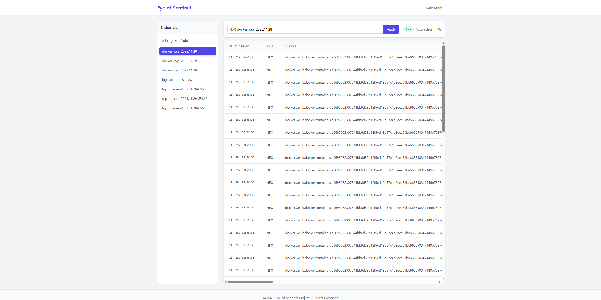

[한국어 (Korean)](README.ko.md)

# Eye of Sentinel (EOS)

### Spring Boot based Real-time Log Dashboard

<p align="center">
  <b>Elasticsearch</b> and <b>OpenSearch</b> supported web log viewer.
  <br>It provides essential log monitoring features quickly and intuitively without complex Kibana configurations.
</p>

---

## Dashboard Preview

Below is the actual running screen of EOS. Check out the clean UI and real-time monitoring features.

<p align="center">
  
</p>

---

## Key Features

EOS offers core features optimized for log analysis and monitoring.

* **Real-Time Log Viewer**
    * Automatically refreshes the latest logs at a specified interval (default 10s).
    * Provides a 'Live' indicator to intuitively show the current monitoring status.

* **Flexible Backend Support**
    * Perfectly compatible with **Elasticsearch (7.x - 8.x)** and **OpenSearch (1.x - 2.x)** clusters.
    * Supports both engines with a single client, allowing use without environment constraints.

* **Dynamic Index & Field Management**
    * Automatically fetches the list of indices existing in the cluster and provides them in the sidebar.
    * Supports multiple index searches using wildcard (*) patterns.
    * Dynamically constructs table headers (columns) by analyzing the mapping information of the index.

* **User-Friendly UI/UX**
    * Provides a modern and responsive web interface built with **Thymeleaf** and **Tailwind CSS**.
    * Supports **Dark Mode**, which automatically switches based on system settings to reduce eye strain.

---

## Tech Stack

| Category | Technology | Note |
| :--- | :--- | :--- |
| **Backend** | Java 17, **Spring Boot 3.2** | Robust backend server construction |
| **Search Client**| Elasticsearch Rest Client | Low-level client for ES/OS compatibility |
| **Frontend** | **Thymeleaf**, **Tailwind CSS** | Server-side rendering and utility-first CSS framework |
| **Build Tool** | Gradle | Dependency management and build automation |

---

## Getting Started

### Prerequisites
* Java 17 or higher
* Running Elasticsearch or OpenSearch instance

### Installation

1.  **Clone the Repository**
    ```bash
    git clone [https://github.com/dev-wonjoon/eye-of-sentinel.git](https://github.com/dev-wonjoon/eye-of-sentinel.git)
    ```

2.  **Configuration (`src/main/resources/application.properties`)**
    Modify the settings according to your search engine information.
    ```properties
    # EOS_OPENSEARCH_URI=http://your-cluster-ip:9200
    # EOS_OPENSEARCH_USERNAME=admin
    # EOS_OPENSEARCH_PASSWORD=your_password
    ```
    *(You can also configure this via environment variables)*

3.  **Run Application**
    ```bash
    # Linux/macOS
    ./gradlew bootRun

    # Windows
    gradlew.bat bootRun
    ```

4.  **Access**
    Open your browser and navigate to `http://localhost:8080`.

---

## License

This project is licensed under the MIT License - see the [LICENSE](LICENSE) file for details.